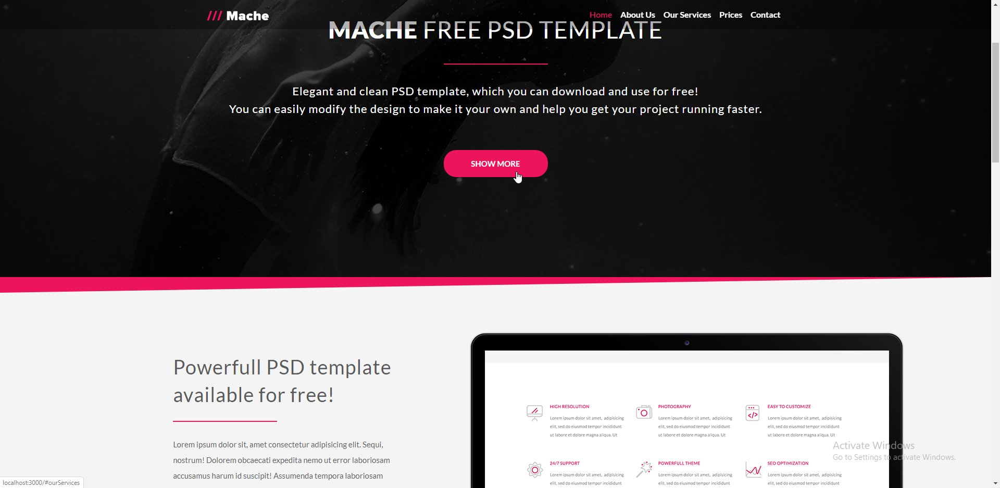

# Mój projekt: mache_template

Zapraszam na moją stronę: [Mache Template](https://jaruto7.github.io/mache-template/)

## Jak uruchomić moją stronę lokalnie

Aby uruchomić stronę lokalnie, wykonaj poniższe instrukcje:

`npm install`

`npm run watch`
